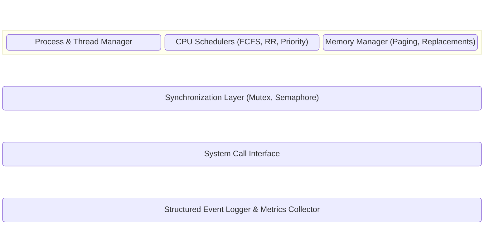

```mermaid
block-beta
  columns 1
  space
  block:SimKernel
    columns 3
    ProcessManager("Process & Thread Manager")
    Scheduler("CPU Schedulers (FCFS, RR, Priority)")
    MemoryManager("Memory Manager (Paging, Replacements)")
  end
  space
  SyncLayer("Synchronization Layer (Mutex, Semaphore)")
  space
  SyscallInterface("System Call Interface")
  space
  Logger("Structured Event Logger & Metrics Collector")
```
