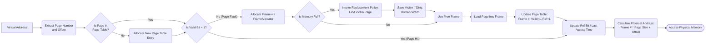

```mermaid
flowchart LR
    A[Virtual Address] --> B(Extract Page Number\nand Offset)
    B --> C{Is Page in\nPage Table?}
    
    C -- No --> D(Allocate New Page Table Entry)
    C -- Yes --> E{Is Valid Bit = 1?}
    
    D --> E
    
    E -- No (Page Fault) --> F(Allocate Frame via FrameAllocator)
    F --> G{Is Memory Full?}
    G -- Yes --> H(Invoke Replacement Policy:\nFind Victim Page)
    H --> I(Save Victim if Dirty,\nUnmap Victim)
    I --> J
    G -- No --> J(Use Free Frame)
    
    J --> K(Load Page into Frame)
    K --> L(Update Page Table:\nFrame #, Valid=1, Ref=1)
    L --> M
    
    E -- Yes (Page Hit) --> M(Update Ref Bit / Last Access Time)
    M --> N(Calculate Physical Address:\nFrame # * Page Size + Offset)
    N --> O([Access Physical Memory])
```
