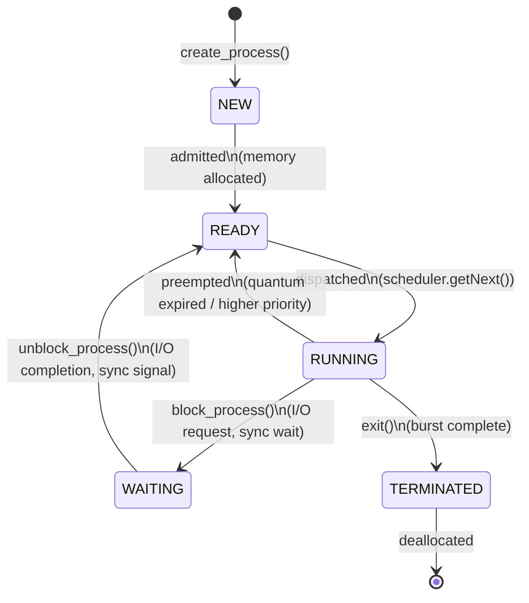

```mermaid
stateDiagram-v2
    [*] --> NEW : create_process()

    NEW --> READY : admitted\n(memory allocated)
    READY --> RUNNING : dispatched\n(scheduler.getNext())
    RUNNING --> READY : preempted\n(quantum expired / higher priority)
    RUNNING --> WAITING : block_process()\n(I/O request, sync wait)
    WAITING --> READY : unblock_process()\n(I/O completion, sync signal)
    RUNNING --> TERMINATED : exit()\n(burst complete)
    
    TERMINATED --> [*] : deallocated
```
